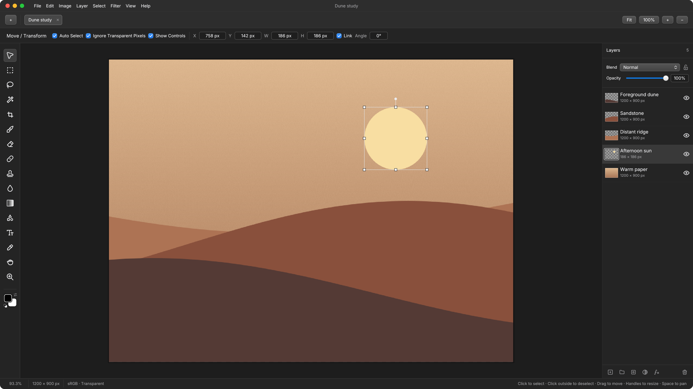

# Xuan

A native image editor for layered compositions, photo retouching, and Nikon RAW development on Linux and Windows.

This project is inspired by [Compositor](https://github.com/robbietilton/Compositor) and is a Rust port of its core features for Linux and Windows. It is a work in progress, and the current release is a demo with basic functionality.



## Features

- Compose with layers, groups, masks, blend modes, editable text, and shapes.
- Use standalone mask layers to mask everything below them, limited to their group when grouped. Click the empty area of the Layers panel to deselect, then click Add layer mask; or choose Layer Mask → New Mask Layer.
- Retouch with selections, brushes, clone stamp, healing, filters, and adjustment layers.
- Develop Nikon NEF/NRW files and return to their RAW settings at any time.
- Open HEIC/HEIF photos directly on Linux and Windows, without installing a converter.
- Save editable `.xuan` projects, import Compositor projects, and export PNG, JPEG, TIFF, or WebP.

## Get started

Download a Linux `.deb`, `.rpm`, portable archive, or Windows `.zip` from [Releases](https://github.com/silverling/xuan/releases). Follow the [installation instructions](docs/USAGE.md#install-and-launch), then launch the demo:

```sh
xuan --demo
```

On Windows, extract the ZIP and launch `xuan.exe`. Windows uses DirectX 12 or Vulkan; Linux supports Wayland and X11 with working Vulkan drivers. See the [user guide](docs/USAGE.md) for installation, file formats, and editing tools. To build from source, follow the [development guide](docs/DEVELOPMENT.md).

[Keyboard shortcuts](docs/SHORTCUTS.md) · [RAW workflow](docs/RAW.md) · [Project format](docs/FORMAT.md)

## License

A Rust port of [Compositor](https://github.com/robbietilton/Compositor). Source code is [MIT licensed](LICENSE); original Compositor copyright © 2026 Wonder Assembly LLC. Dependency licenses and rebuild instructions are in [third-party notices](THIRD_PARTY.md).
